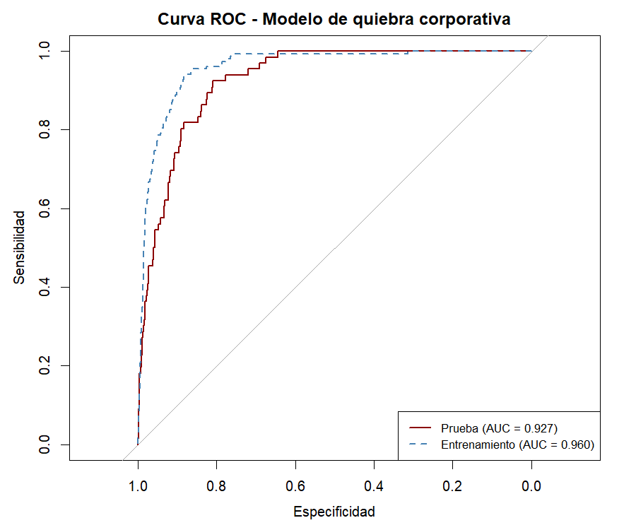
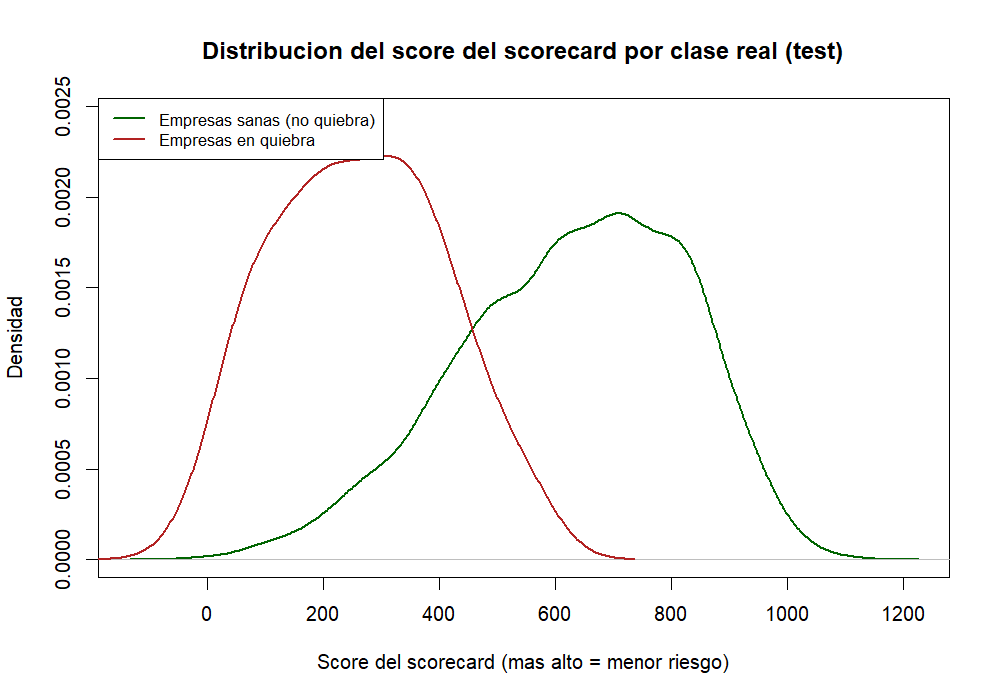
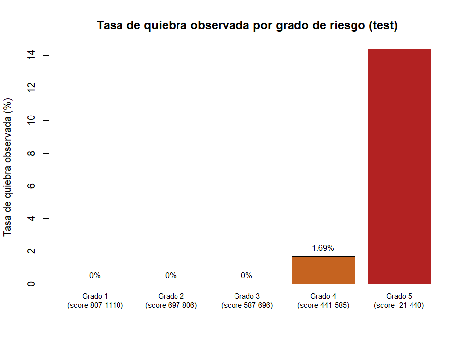
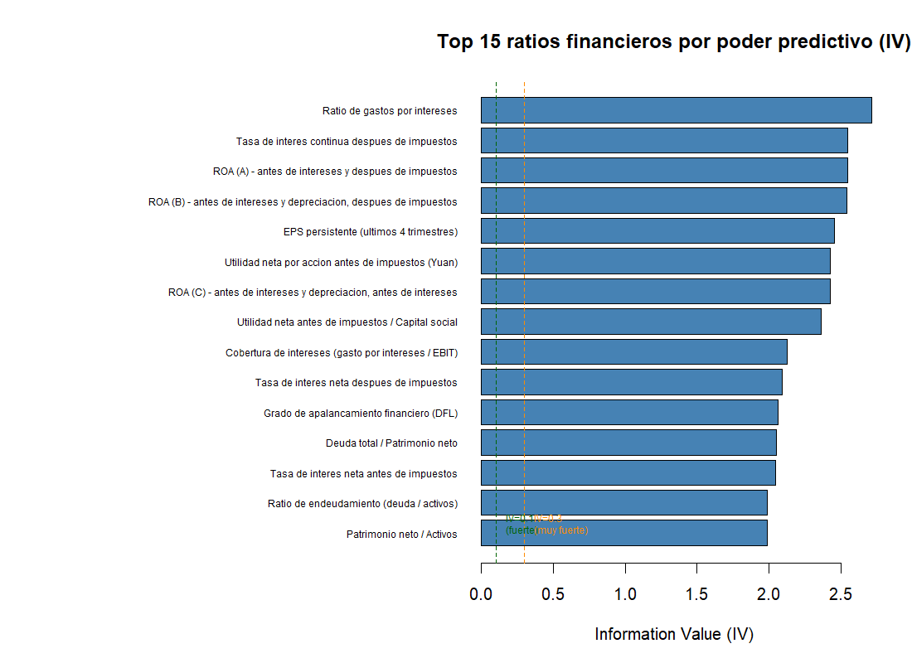

# Scorecard de riesgo de quiebra corporativa — Bolsa de Taiwán

*Informe financiero — caso piloto de portfolio*

> Ver también el [dashboard interactivo](dashboard.html) complementario a este informe, con el detalle navegable de las 2.046 empresas de la muestra de test.

---

## 1. Objetivo del análisis

Este análisis construye un **scorecard de riesgo crediticio corporativo** —una
herramienta que asigna un puntaje y un grado de riesgo a una empresa a partir
de sus ratios financieros, estimando su probabilidad de quiebra— sobre un
dataset real de 6.819 empresas listadas en la Bolsa de Taiwán.

El destinatario de este trabajo **no es un cliente real con datos propios**:
es una **pieza de portfolio/demostración de capacidad técnica**, pensada para
mostrar a potenciales clientes del
sector financiero y de riesgo crediticio (bancos, fintechs, consultoras de
riesgo) que un scorecard de este tipo —metodología, rigurosidad y forma de
comunicar el resultado— puede construirse y entregarse de punta a punta. La
pregunta de negocio que resuelve, en términos generales aplicables a
cualquier cliente real que encargara un trabajo similar, es: *dado el
balance y el estado de resultados de una empresa, ¿qué tan probable es que
entre en quiebra, y cómo se traduce eso en una decisión de crédito o
inversión (otorgar, rechazar, ajustar tasa, monitorear de cerca)?*

## 2. Problema abordado

Es un problema de **clasificación binaria supervisada con desbalance de
clases severo**: predecir si una empresa quiebra (1) o no (0) a partir de 95
ratios financieros, sobre un universo donde solo el **3,23% de los casos
(220 de 6.819 empresas) corresponde a quiebras reales** y el 96,77% restante
son empresas sanas. Este desbalance no es un detalle técnico menor: es la
característica central que condiciona toda decisión metodológica posterior
(selección de variables, ponderación del modelo, elección de métricas y
punto de corte), porque un modelo ingenuo que nunca prediga quiebra ya
acertaría en el 96,8% de los casos sin ningún valor predictivo real.

El objetivo estadístico es estimar la **probabilidad de default (PD)** de
cada empresa y traducirla en un **puntaje (score) y un grado de riesgo
discreto**, el formato estándar en el que la industria bancaria y de riesgo
crediticio consume este tipo de modelo (no una probabilidad cruda, sino una
tabla de puntos auditable).

## 3. Modelo(s) matemático(s)/estadístico(s) utilizado(s)

Se usó la metodología **estándar de la industria de riesgo crediticio**
(la misma familia de enfoque que usa FICO y que usan los bancos para
scorecards de PD bajo el marco de Basilea), en tres etapas:

**a) Weight of Evidence (WOE) + Information Value (IV) para selección y
transformación de variables.** Cada uno de los 95 ratios financieros se
agrupa en tramos (bins) y a cada tramo se le calcula el WOE, una medida de
cuánto ese tramo concentra empresas quebradas frente a sanas en relación con
el resto de la variable. El IV agrega esa información en un único número
por variable que resume su poder discriminante total. Se usó un umbral
estándar de la industria (IV ≥ 0,02) para descartar del análisis las
variables sin poder predictivo relevante, y de las 95 variables originales
quedaron preseleccionadas 63 (el IV mínimo entre las preseleccionadas es 0,0388,
según `results/01_iv_ranking_variables.csv`). Este paso es clave en un problema desbalanceado
porque el IV no se distorsiona por la proporción de clases, a diferencia de
otras medidas de asociación.

**b) Regresión logística ponderada sobre las variables en WOE, con
selección stepwise.** Sobre las variables preseleccionadas se descartaron
además las que estaban muy correlacionadas entre sí (correlación > 0,85),
quedándose en cada par con la de mayor IV —los ratios financieros suelen
venir en familias casi idénticas (ej. tres variantes de "valor neto por
acción"), y meterlas todas juntas no agrega poder predictivo, solo infla el
modelo—. Con las **39 variables finales** se ajustó una regresión logística,
con selección stepwise por AIC para quedarse con el subconjunto más
parsimonioso, y con los casos de empresas quebradas **ponderados** por la
proporción inversa de su frecuencia (aproximadamente 30 veces el peso de un
caso sano) para que el modelo no colapse en predecir siempre "no quiebra"
—el riesgo natural de ajustar un modelo sin corrección sobre una clase tan
minoritaria—.

**c) Escalado a scorecard de puntos (convención PDO).** El resultado de la
regresión logística se convierte en una tabla de puntos por tramo de cada
variable, usando la convención estándar "Points to Double the Odds" (PDO):
se fijó un puntaje base de 600 puntos para un odds de referencia de 1 quiebra
cada 19 empresas sanas (~95% de probabilidad de "no quiebra"), con una
escala en la que **cada 50 puntos adicionales duplican el odds de que la
empresa sea sana** frente a que quiebre. Esta es la misma lógica de escala
que usan los scorecards estilo FICO, y el cliente final puede recalibrar
estos dos parámetros (punto base y PDO) a su propia escala de rating interno
sin tener que recalcular el modelo subyacente.

**Por qué esta metodología y no un modelo de caja negra (Random Forest,
XGBoost) como modelo principal:** en el dominio de riesgo crediticio
regulado (Basilea, IFRS 9), lo que se exige no es solo capacidad predictiva
sino **interpretabilidad y monotonía verificable variable por variable**. Un
scorecard de puntos es auditable línea por línea por un comité de riesgo
("esta empresa perdió 83 puntos porque su ratio X cayó en este tramo"); un
modelo de árboles o boosting no ofrece esa trazabilidad sin herramientas
adicionales de explicabilidad. Por eso se usó **Random Forest únicamente
como validación cruzada independiente** de qué variables son realmente
predictivas —un chequeo de robustez del ranking obtenido por IV—, no como
modelo de producción.

## 4. Métricas de resultado y tipo de estimación

Dado el desbalance de clases, se evitó deliberadamente apoyar la evaluación
en accuracy simple, y se usó un conjunto de métricas estándar de la
industria de credit scoring, todas calculadas en **test fuera de muestra**
(30% de las empresas, no usado para entrenar el modelo):

| Métrica | Valor (test) | Qué mide y por qué se eligió |
|---|---|---|
| **AUC-ROC** | 0,93 | Probabilidad de que el modelo asigne mayor riesgo a una empresa que efectivamente quebró que a una que no, promediada sobre todos los posibles puntos de corte. Es robusta a la proporción de clases, por eso es la métrica de referencia en clasificación desbalanceada. |
| **KS (Kolmogorov-Smirnov)** | 0,74 | Máxima distancia entre la distribución acumulada de scores de empresas sanas y la de empresas quebradas. Es la métrica que más usa la industria bancaria para evaluar scorecards (más intuitiva que el AUC para un analista de riesgo) y, junto con el AUC, es la razón por la que **no se reporta accuracy como métrica principal**: un modelo que prediga siempre "no quiebra" tendría ~96,8% de accuracy sin ningún valor predictivo, así que esa métrica sola sería directamente engañosa en este problema. |
| **Gini** | 0,85 | Transformación lineal del AUC (2×AUC−1), de uso extendido en la literatura de riesgo crediticio como sinónimo de poder discriminante del modelo. |
| **AUC-PR (precision-recall)** | 0,33 | Complementa al AUC-ROC bajo desbalance extremo: se reporta explícitamente para que no se sobreestime el desempeño real mirando solo el AUC-ROC (con solo 3,2% de prevalencia, el AUC-PR de un modelo perfecto está lejos de 1, así que 0,33 debe leerse en ese contexto, no en términos absolutos). |
| **Sensibilidad (recall de quiebras)** | 81,8% | De cada 100 empresas que efectivamente quebraron en test, el modelo identificó correctamente a 82 como de alto riesgo (con el punto de corte elegido). Es la métrica que más le importa a un comité de riesgo: cuántas quiebras reales *no* se dejan pasar. |
| **Especificidad** | 87,7% | De cada 100 empresas sanas, el modelo clasifica correctamente a 88 como bajo riesgo. Relevante porque una especificidad baja significa rechazar o encarecer crédito a empresas sanas innecesariamente. |
| **Accuracy del modelo** | 87,5% | Se reporta solo como referencia general, nunca como métrica de decisión. |
| **Accuracy del modelo "naive"** (predecir siempre "no quiebra") | 96,8% | Se calcula deliberadamente para ilustrar por qué el accuracy simple es engañoso acá: un modelo sin ningún valor predictivo real supera en accuracy bruta al modelo real (87,5%), precisamente por el desbalance de clases. |

El **punto de corte** (umbral de probabilidad a partir del cual se clasifica
una empresa como "alto riesgo") se determinó con el estadístico de Youden
sobre train (0,49) y se aplicó a test — no se usó el 0,5 por defecto, que en
un problema con 3,2% de prevalencia casi nunca se dispara y dejaría pasar la
gran mayoría de las quiebras reales.

Sobre esa base se construyeron **5 grados de riesgo** (quintiles de score en
test), con la tasa de quiebra real observada en cada uno:

| Grado | Rango de score | Empresas (test) | Quiebras observadas | Tasa de quiebra |
|---|---|---|---|---|
| Grado 1 (mejor) | 807 – 1.110 | 406 | 0 | 0,00% |
| Grado 2 | 697 – 806 | 409 | 0 | 0,00% |
| Grado 3 | 587 – 696 | 407 | 0 | 0,00% |
| Grado 4 | 441 – 585 | 414 | 7 | 1,69% |
| Grado 5 (peor) | −21 – 440 | 410 | 59 | 14,39% |

La relación entre grado y tasa de quiebra observada es **monótona y
perfecta**: a menor score, mayor tasa de quiebra real, sin ninguna
inversión entre grados. El 20% de empresas peor calificado (Grado 5)
concentra el **89% de las quiebras reales** observadas en test (59 de 66); los
tres grados superiores (60% de las empresas) tuvieron **cero quiebras**
observadas en test.

*Curva ROC del modelo en train y test — la caída moderada de AUC entre train (0,96) y test (0,93) es razonable y no sugiere sobreajuste severo.*

*Distribución del score por clase real: las empresas sanas se concentran en scores altos y las quebradas en scores bajos, con una superposición esperable en la zona media.*

### Variables más predictivas

El ranking de variables por IV (confirmado de forma independiente por
Random Forest) está liderado por ratios de **carga financiera/costo de la
deuda** y de **rentabilidad**, no por los ratios clásicos de liquidez:

| Ranking | Variable (IV) | Variable (Random Forest) |
|---|---|---|
| 1 | Ratio de gastos por intereses (Interest Expense Ratio) | EPS persistente en los últimos 4 trimestres |
| 2 | Tasa de interés continua después de impuestos | Tasa de interés continua después de impuestos |
| 3 | ROA (rentabilidad sobre activos), variante A | Dependencia del financiamiento externo (deuda) |
| 4 | ROA, variante B (antes de intereses y depreciación) | Patrimonio neto / Activos totales |
| 5 | EPS persistente en los últimos 4 trimestres | ROA, variante B |

Tres variables (tasa de interés continua después de impuestos, EPS
persistente y ROA variante B —antes de intereses y depreciación, después de
impuestos—) aparecen en el top 5 de **ambos** métodos —evidencia
independiente de que son las señales más robustas—. Ratios clásicos de
apalancamiento y liquidez también quedaron entre las 39 variables finales
del scorecard, aunque con un poder discriminante individual menor: Deuda
Total/Patrimonio Neto (posición 12 por IV), Quick Ratio (22), Current Ratio
(25), Operating Profit Rate (26). Que el poder predictivo esté dominado por
carga de intereses, ROA y EPS —y no solo por apalancamiento y liquidez
puros— sigue siendo coherente con la literatura clásica de scoring de
quiebra (el Altman Z-Score, por ejemplo, también pondera fuertemente
rentabilidad operativa y utilidades retenidas, además del apalancamiento).

## 5. Conclusiones

- El modelo tiene un **poder discriminante alto y estable** (AUC 0,93 y KS
  0,74 en test, fuera de muestra), con una caída razonable respecto a train
  (AUC 0,96) que no sugiere sobreajuste severo.
- El scorecard resultante produce una **jerarquía de riesgo monótona y sin
  inversiones**: a peor grado, estrictamente mayor tasa de quiebra
  observada, algo que no está garantizado de antemano y que es el resultado
  más valioso desde el punto de vista de negocio (es lo que hace que el
  scorecard sea utilizable para tomar decisiones de crédito por tramos).
- El modelo concentra el 89% de las quiebras reales en el 20% de empresas
  peor calificadas, y no tuvo ningún falso positivo de quiebra entre el 60%
  mejor calificado — es decir, discrimina con fuerza en ambos extremos de
  la distribución de riesgo, que es donde más importa para una decisión de
  crédito (a quién rechazar de plano y a quién aprobar sin fricción).
- **Limitación explícita, no oculta ni suavizada:** varios de los 95 ratios
  financieros de este dataset —el caso más claro es Current Ratio, pero el
  patrón de rangos comprimidos aparece también en otras variables del
  archivo de resultados (`results/02_scorecard_puntos.csv`)— vienen **pre-normalizados
  por la fuente de datos (UCI/Kaggle) de una forma que no está completamente
  documentada**. Current Ratio, por ejemplo, aparece en rangos de 0 a 0,02 en
  vez de los 0,5x–3x típicos de un ratio de liquidez corriente real. El
  poder discriminante del modelo es igualmente válido desde el punto de
  vista estadístico —el modelo aprende de la posición relativa de cada
  empresa dentro de esa escala normalizada, no de su valor absoluto—, pero
  **la escala de estas variables no debe leerse con la interpretación
  convencional del ratio** (no interpretar 0,01 de Current Ratio como "1% de
  liquidez"). Adicionalmente, dentro de la tabla de puntos final, la
  contribución de Current Ratio sí es monótona tramo por tramo (66, 26, 1,
  −28 y −83 puntos en los cinco tramos, de menor a mayor ratio según
  `results/02_scorecard_puntos.csv`), pero en **dirección invertida a la lectura
  convencional de un ratio de liquidez**: a mayor Current Ratio normalizado,
  el modelo resta puntos (asigna más riesgo), en vez de sumarlos como
  esperaría la intuición financiera estándar ("más liquidez, menos riesgo").
  Esto es consistente con que esta variable entra al modelo multivariado ya
  afectada por la normalización de escala señalada arriba y por su
  correlación con otras variables retenidas — un punto que dejamos señalado
  para quien vaya a explicar esta variable puntual a un cliente real, en vez
  de asumir una lectura directa.
- El caso queda validado como **pieza de portfolio de demostración de
  capacidad técnica**: metodología estándar de industria bien documentada,
  métricas apropiadas al problema (no solo accuracy), resultado auditable
  variable por variable, y limitaciones comunicadas con transparencia en
  vez de ocultas — exactamente el estándar que un cliente de riesgo
  crediticio esperaría de un entregable profesional.

## 6. Decisión recomendada en función de los resultados

**Para el uso previsto de este análisis (pieza de portfolio/demostración
técnica):** el scorecard está listo para publicarse como caso piloto,
acompañado del informe y del dashboard, siempre que se incluya de forma
visible la nota de la limitación de escala de Current Ratio (y variables
similares) descrita arriba — mostrar un scorecard a un cliente potencial sin
esa aclaración podría transmitir una lectura incorrecta de esa variable
puntual y dañar la credibilidad técnica del portfolio, que es exactamente lo
que este entregable busca construir.

**Si este mismo enfoque se replicara para un cliente real con datos
propios** (la aplicación de negocio que este caso demuestra), la
recomendación concreta que se desprende de los resultados sería: usar el
scorecard como **herramienta de pre-clasificación en 5 tramos de riesgo**,
con una política diferenciada por grado —aprobación ágil o con mínima
fricción para Grados 1–3 (0% de quiebras observadas en esta muestra),
revisión manual reforzada para Grado 4 (riesgo bajo pero no nulo, 1,7%), y
rechazo o exigencia de garantías/tasas ajustadas para Grado 5 (14,4% de
tasa de quiebra observada, casi 4,5 veces la tasa base del dataset)—, nunca
como sustituto único y automático del juicio de un comité de crédito, dado
que ningún modelo con 82% de sensibilidad deja de tener un 18% de quiebras
que no detecta a tiempo.

## 7. Fuentes de los datos

**Datos públicos**, sin ningún componente privado ni confidencial en este
caso.

- **Fuente:** UCI Machine Learning Repository, dataset *"Taiwanese
  Bankruptcy Prediction"* (id 572) — datos reales del Taiwan Economic
  Journal, empresas listadas en la Bolsa de Taiwán entre 1999 y 2009.
  También disponible espejado en Kaggle bajo el mismo nombre.
- **Enlace de descarga:**
  https://archive.ics.uci.edu/static/public/572/taiwanese+bankruptcy+prediction.zip
- **Tamaño y composición:** 6.819 empresas, 95 ratios financieros como
  variables explicativas, variable objetivo binaria "Bankrupt?" (1 =
  quiebra, 0 = no quiebra), con 220 quiebras reales (3,23%) y 6.599 empresas
  sanas (96,77%).

---

## Anexo — archivos de este análisis

- Script del análisis: `modelo_scorecard_quiebra.R`
- Dataset fuente: `taiwan_bankruptcy_data.csv`
- Resultados: `results/01_iv_ranking_variables.csv`, `results/02_scorecard_puntos.csv`,
  `results/03_metricas_desempeno.csv`, `results/04_grados_de_riesgo.csv`,
  `results/05_importancia_random_forest.csv`, `results/06_scores_empresas_test.csv`
- Gráficos: `plots/grafico_curva_roc.png`, `plots/grafico_top_variables_iv.png`,
  `plots/grafico_distribucion_score.png`, `plots/grafico_tasa_quiebra_por_grado.png`
- Dashboard interactivo: `dashboard.html`
